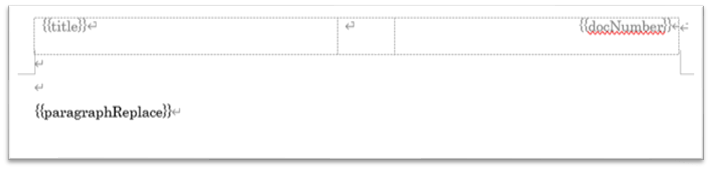

The template has some placeholders and some styles set up.

## Sample template

[Download here](https://github.com/toramameseven/markdown-docx/tree/main/templates)

- _no_cover.docx (usually use this template)
- _with_cover.docx

## Applying a template

Set the following content in the first part of the markdown file:

`<!-- word docxTemplate _with_cover.docx -->`

For templates that you have created yourself, change the above file name part in the same folder as the markdown file.

## placeholder

It uses DOCX specification placeholders. The following is an example of a placeholder.

### `{{paragraphReplace}}`

A placeholder for the document body. It may not be modified or used for any other purpose.

### `{{title}}`

`<!-- word placeholder title XXXX -->` will replace it with XXX. `# XXX` also has `XXX` as its title.

### `{{docNumber}}`

`<!-- word placeholder docNumber A0001-1010 -->` will be replaced with `A0001-1010`.

Additionally, you can set placeholders and replace them with placeholder commands.

## style

The template has the following styles:

- hh1 to hh5
    - markdown `##` to `######`
- body1
    - No body indentation
- body2
    - With text indentation
- body3
    - With text indentation
- code
    - for source code
- codespan
    - `codespan` for character decoration
- nList1
- nList2
- nList3
    - bullet points
- numList1
- numList2
- numList3
    - Bullet points (numbered)
- picture1
- note1
    - `NOTE: This is a note. ` Style set when .
- warn1
    - `WARN: This is a warning. `The style set when `.
- styleN: table style
    - style for table

