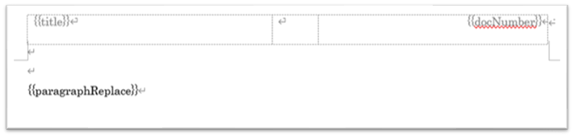

テンプレートは、いくつかのプレースホルダといくつかのスタイルが設定してあります。

## テンプレートのサンプル

[ここからダウンロード](https://github.com/toramameseven/markdown-docx/tree/main/templates)

- _no_cover.docx （通常はこのテンプレートを使用します）
- _with_cover.docx

## テンプレートの適用

マークダウンファイルの最初の部分に、次の内容を設定します。

`<!-- word docxTemplate _with_cover.docx -->`

独自に作成したテンプレートは、マークダウンファイルと同じフォルダにおいて、上記のファイル名の部分を変更します。

## プレースホルダ

DOCX仕様のプレースホルダを利用しています。次は、プレースホルダの例です。

### `{{paragraphReplace}}`

文書本体用のプレースホルダです。変更したり、他の目的では利用できません。

### `{{title}}`

`<!-- word placeholder title XXXX -->` とすると、XXXに置き換わります。 また `# XXX`も`XXX`がタイトルになります。

### `{{docNumber}}`

`<!-- word placeholder docNumber A0001-1010 -->` とすると、`A0001-1010`に置き換わります。

そのた、プレースホルダを設定し、プレースホルダ用のコマンドにより置き換えが可能です。

## スタイル

テンプレートには、次のスタイルが設定してあります。

- hh1 to hh5
    - markdown `##` to `######`
- body1
    - 本文インデントなし
- body2
    - 本文インデントあり
- body3
    - 本文インデントあり
- code
    - ソースコード用
- codespan
    - `codespan` 文字装飾用
- nList1
- nList2
- nList3
    - 箇条書き
- numList1
- numList2
- numList3
    - 箇条書き(番号付き)
- picture1
- note1
    - `NOTE: これは注記です。` の時に設定されるスタイル。
- warn1
    - `WARN: これは注意です。` のときに設定されるスタイル`。
- styleN: table style
    - テーブル用スタイル

